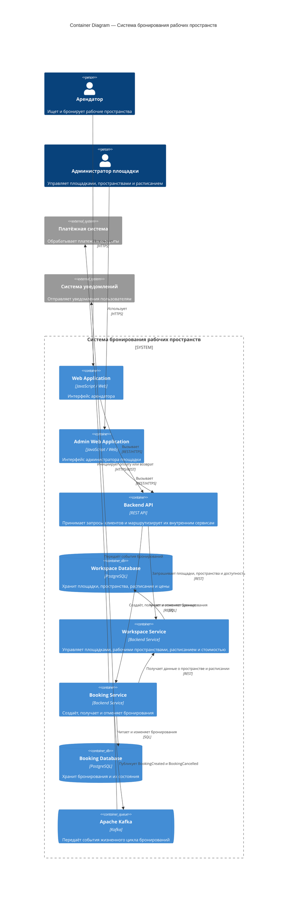

## 2.2. Container Diagram

Контейнерная диаграмма описывает основные программные компоненты системы бронирования рабочих пространств, зоны их ответственности, способы взаимодействия и используемые хранилища данных.

### Web Application

**Тип:** Web Application

Клиентское веб-приложение, предназначенное для арендаторов рабочих пространств.

Основные функции:

* просмотр площадок;
* просмотр доступных рабочих пространств;
* поиск доступных временных слотов;
* просмотр стоимости аренды;
* создание бронирования;
* получение информации о бронировании;
* отмена бронирования.

Web Application взаимодействует с Backend API по протоколу HTTPS посредством REST API.

Собственное постоянное состояние контейнер не хранит.

### Admin Web Application

**Тип:** Web Application

Веб-приложение, предназначенное для администраторов площадок.

Основные функции:

* управление информацией о площадке;
* управление рабочими пространствами;
* управление расписанием доступности;
* управление стоимостью аренды;
* просмотр бронирований рабочих пространств площадки.

Admin Web Application взаимодействует с Backend API по протоколу HTTPS посредством REST API.

Собственное постоянное состояние контейнер не хранит.

### Backend API

**Тип:** Application / API Gateway

Backend API является единой точкой входа для клиентских приложений системы.

Основные функции:

* приём HTTP-запросов от Web Application и Admin Web Application;
* аутентификация и авторизация запросов;
* маршрутизация запросов к соответствующим внутренним сервисам;
* формирование HTTP-ответов клиентским приложениям.

Backend API вызывает Workspace Service для получения информации о площадках, рабочих пространствах, расписании и ценах.

Backend API вызывает Booking Service для создания, получения и отмены бронирований.

Постоянное состояние Backend API не хранит.

### Workspace Service

**Тип:** Backend Service

Сервис отвечает за управление информацией о площадках и доступных для бронирования рабочих пространствах.

Основные функции:

* управление площадками;
* управление рабочими пространствами;
* управление расписанием доступности;
* управление стоимостью аренды;
* предоставление информации о доступных рабочих пространствах и временных слотах.

Workspace Service взаимодействует с Workspace Database для чтения и изменения информации о площадках, пространствах, расписании и стоимости.

Booking Service может обращаться к Workspace Service для проверки существования рабочего пространства, получения его параметров и определения доступности выбранного временного интервала.

### Booking Service

**Тип:** Backend Service

Сервис отвечает за управление жизненным циклом бронирований.

Основные функции:

* создание бронирования;
* проверка возможности создания бронирования;
* предотвращение двойного бронирования рабочего пространства;
* получение информации о бронировании;
* отмена бронирования;
* хранение текущего состояния бронирования;
* публикация событий жизненного цикла бронирования.

При создании бронирования Booking Service проверяет доступность рабочего пространства и сохраняет новое бронирование в Booking Database.

После успешного создания бронирования сервис публикует событие `BookingCreated` в Apache Kafka.

После успешной отмены бронирования сервис изменяет состояние бронирования и публикует событие `BookingCancelled` в Apache Kafka.

### Workspace Database

**Тип:** Database

Хранилище данных о площадках и рабочих пространствах.

В базе данных хранятся:

* площадки;
* рабочие пространства;
* типы рабочих пространств;
* расписание доступности;
* стоимость аренды.

В качестве СУБД может использоваться PostgreSQL.

Владельцем данных является Workspace Service.

### Booking Database

**Тип:** Database

Хранилище данных о бронированиях.

В базе данных хранятся:

* идентификатор бронирования;
* идентификатор пользователя;
* идентификатор рабочего пространства;
* временной интервал бронирования;
* зафиксированная стоимость;
* статус бронирования;
* дата и время создания;
* дата и время изменения.

В качестве СУБД может использоваться PostgreSQL.

Владельцем данных является Booking Service.

### Apache Kafka

**Тип:** Message Broker

Apache Kafka используется для асинхронного обмена событиями между системой бронирования и заинтересованными потребителями.

Booking Service публикует события:

* `BookingCreated` — после успешного создания бронирования;
* `BookingCancelled` — после успешной отмены бронирования.

События могут использоваться другими компонентами и внешними системами для выполнения асинхронных действий, например отправки уведомлений, аналитики или инициирования связанных бизнес-процессов.

Kafka хранит сообщения в рамках настроенной политики хранения сообщений, но не является основным хранилищем состояния бронирований.

### Payment System

**Тип:** External System

Внешняя система, предназначенная для обработки платежей и возвратов денежных средств.

В случае реализации платного бронирования Booking Service или отдельный платёжный компонент инициирует взаимодействие с Payment System.

Платёжная информация и состояние платежей не являются основным состоянием Booking Service и могут храниться во внешней платёжной системе либо специализированном сервисе платежей.

### External Booking System

**Тип:** External System

Внешняя система, предназначенная для бронирования пространств, управляемых сторонней системой бронирования.

External Booking System получает запросы о статусе управляемых ей пространств, свободных временных слотах, бронирует слоты по запросу  Booking Service и подтверждает бронирование.

### Notification System

**Тип:** External System

Внешняя система, предназначенная для отправки уведомлений пользователям.

Notification System получает информацию о событиях жизненного цикла бронирований, например `BookingCreated` и `BookingCancelled`, и на их основании отправляет пользователю соответствующие уведомления.

## Взаимодействие контейнеров

Основные взаимодействия между контейнерами выполняются следующим образом:

1. Арендатор использует Web Application.
2. Администратор площадки использует Admin Web Application.
3. Клиентские приложения отправляют REST-запросы в Backend API.
4. Backend API маршрутизирует запросы на получение площадок, пространств и доступных слотов в Workspace Service.
5. Backend API маршрутизирует запросы создания, получения и отмены бронирований в Booking Service.
6. Workspace Service читает и изменяет данные в Workspace Database.
7. Booking Service читает и изменяет данные в Booking Database.
8. Booking Service при необходимости обращается к Workspace Service для получения информации о рабочем пространстве и проверки его доступности.
9. После успешного создания бронирования Booking Service публикует событие `BookingCreated` в Apache Kafka.
10. После успешной отмены бронирования Booking Service публикует событие `BookingCancelled` в Apache Kafka.
11. Заинтересованные потребители, например Notification System, получают события и выполняют соответствующие действия.

## Хранение состояния

Основное постоянное состояние системы хранится в реляционных базах данных.

**Workspace Database** хранит состояние предметной области, связанное с площадками, рабочими пространствами, расписанием и стоимостью.

**Booking Database** хранит состояние бронирований и является источником истины для информации о созданных и отменённых бронированиях.

Клиентские приложения и Backend API постоянное бизнес-состояние не хранят.

Apache Kafka используется для передачи и временного хранения событий, но не является источником истины для текущего состояния бронирований.

## Важно!
**Booking Service** является единственным владельцем операции резервирования временного интервала и именно на уровне Booking Database обеспечивает невозможность пересекающихся активных бронирований. **Workspace Service** при этом отвечает за базовое расписание — например, что переговорная доступна с 09:00 до 21:00, — а Booking Service определяет, свободна ли она внутри этого расписания с учётом уже существующих бронирований.

## Схема контейнеров

