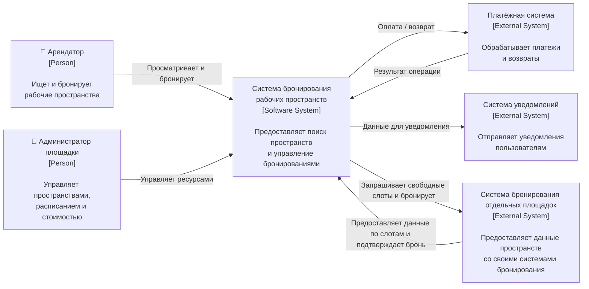

## 2.1. Context Diagram

Контекстная диаграмма определяет границы системы бронирования рабочих пространств и отображает её взаимодействие с пользователями и внешними информационными системами.

**Проектируемая система**

Система бронирования рабочих пространств (Workspace Booking System) — информационная система, которая предоставляет пользователям возможность поиска и бронирования рабочих пространств различных площадок. Система хранит информацию о площадках, доступных рабочих пространствах, расписании, стоимости и созданных бронированиях.

**Система обеспечивает:**

-просмотр доступных площадок и рабочих пространств;
-получение информации о доступных временных слотах;
-создание бронирования;
-получение информации о бронировании;
-отмену бронирования;
-управление рабочими пространствами и их расписанием со стороны площадок;
-взаимодействие с внешними системами оплаты и уведомлений.

### Пользователи системы

**Арендатор (Renter)** — пользователь, который использует систему для поиска и бронирования рабочего пространства.

Арендатор взаимодействует с системой для выполнения следующих операций:

-просмотр доступных площадок;
-просмотр рабочих пространств выбранной площадки;
-просмотр доступных временных слотов;
-просмотр стоимости аренды;
-создание бронирования;
-получение информации о созданном бронировании;
-отмена бронирования.

**Администратор площадки (Venue Administrator)** — представитель площадки, управляющий предоставляемыми для аренды рабочими пространствами.

Администратор площадки взаимодействует с системой для выполнения следующих операций:

-управление информацией о площадке;
-управление списком рабочих пространств;
-управление расписанием доступности рабочих пространств;
-управление стоимостью аренды;
-получение информации о бронированиях ресурсов своей площадки.

### Внешние системы

**Платёжная система (Payment System)** — внешняя информационная система, используемая для проведения платежей, связанных с бронированием рабочих пространств.

Система бронирования передаёт в платёжную систему запросы на проведение платежей и при необходимости возврата денежных средств. Платёжная система возвращает результат выполнения платёжной операции.

**Система уведомлений (Notification System)** — внешняя информационная система, используемая для доставки уведомлений пользователям.

Система бронирования передаёт в систему уведомлений информацию о событиях, требующих информирования пользователя, например:

-успешное создание бронирования;
-подтверждение бронирования;
-отмена бронирования.

Система уведомлений осуществляет доставку сообщений пользователям через поддерживаемые каналы связи, например email, SMS или push-уведомления.

**Внешняя система бронирования** - внешняя информационная система, которая может являться мастер-системой бронирования уже существующей на отдельных площадках, на которых сдаются в аренду пространства.

Система бронирования взаимодействует с внешней системой бронирования для запроса данных по отдельным площадкам, например:

-запрос статусов пространств;
-запрос свободных слотов для пространства;
-запрос бронирования слота пространства.

## Границы системы

В границы проектируемой системы входят функции, связанные с управлением площадками и рабочими пространствами, хранением информации об их доступности и стоимости, а также созданием, хранением, получением и отменой бронирований.

За границами проектируемой системы находятся:

-пользователи системы — арендаторы;
-администраторы площадок;
-платёжная система;
-система уведомлений;
-система бронирования отдельных площадок.

Проведение платёжных операций и непосредственная доставка уведомлений не входят в ответственность системы бронирования. Проектируемая система только инициирует соответствующие операции во внешних системах и обрабатывает результаты взаимодействия с ними.

## Диаграмма контекста

